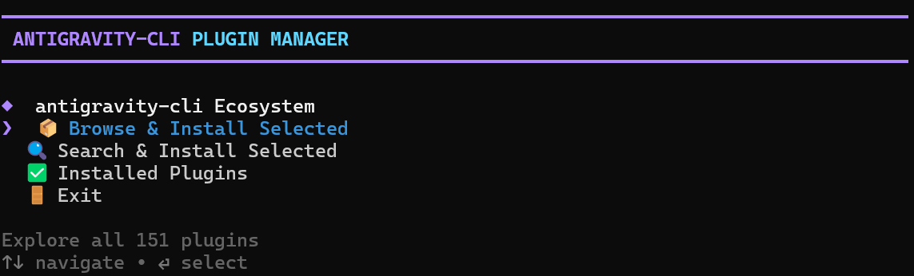
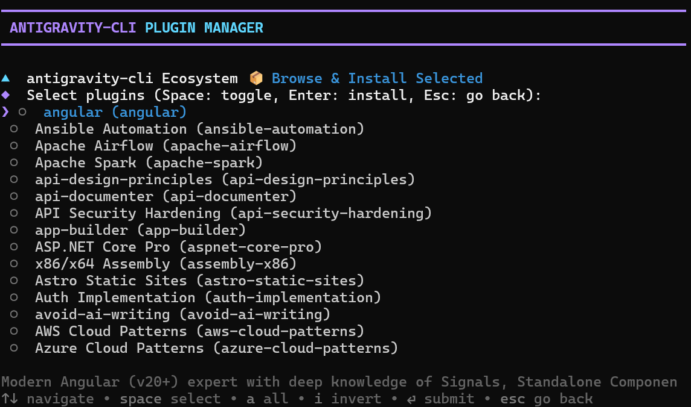
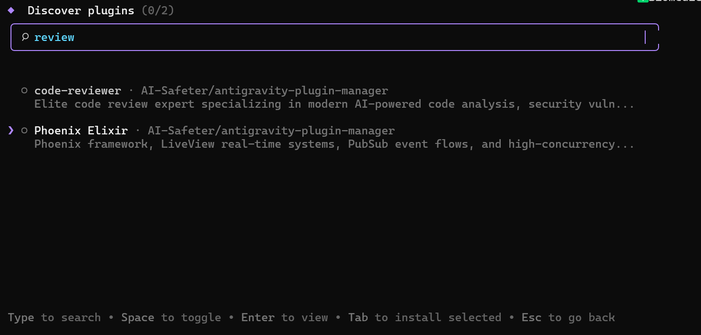
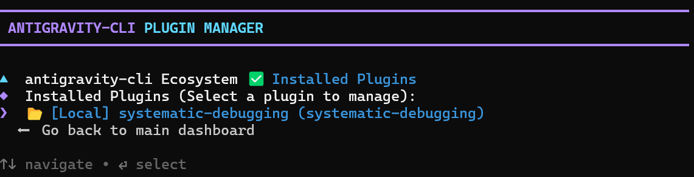

<h1 align="center">antigravity-cli Plugin Manager (ag-plugin)</h1>

<p align="center">
  <b>Install and manage custom skills for your AI agent.</b>
</p>

<p align="center">
  <a href="https://opensource.org/licenses/MIT"></a>
  <a href="https://antigravity.google"></a>
  <a href="https://www.npmjs.com/package/@beidawuli/antigravity-plugin-manager"></a>
</p>

The `ag-plugin` CLI is a package manager for the `antigravity-cli` tool. It provides a terminal interface to discover, validate, and install agent skills from a curated set of registries — including Anthropic's official skills, K-Dense scientific skills, and the local core collection — into your workspace.

## Prerequisites

To install and run this tool, you will need npm (Node Package Manager) installed. If you do not have it installed, you can download it from the official website: [https://nodejs.org/en/download/](https://nodejs.org/en/download/).

## Quick Start

You can run the interactive dashboard directly without cloning the repository.

```bash
# Run without installing
npx ag-plugin

# Or install globally
npm install -g @beidawuli/antigravity-plugin-manager
ag-plugin
```

## Interface and Usage

The CLI operates through a fast, interactive terminal menu. 



You can browse the entire collection of skills sequentially:



Or you can fuzzy-search the registry for specific keywords.



When you're done, review your active local and global installations from the management screen:



## Contributing

You can contribute new skills to the repository. Please read [CONTRIBUTING.md](CONTRIBUTING.md) for details on submitting pull requests, style rules, and validation checks.

## License

This project is licensed under the MIT License. See [LICENSE](LICENSE) for details.
