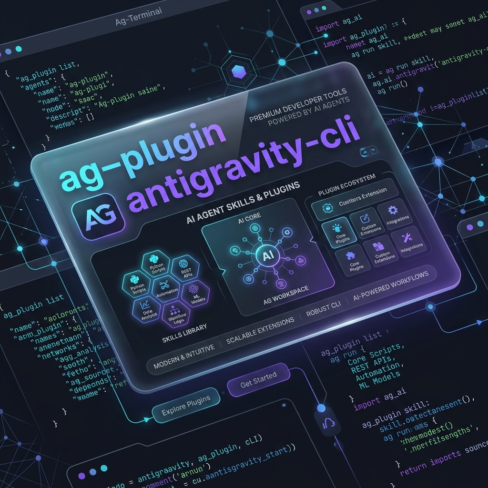

<p align="center">
  
</p>

<h1 align="center">🛸 antigravity-cli Plugin Ecosystem (`ag-plugin`)</h1>

<p align="center">
  <b>Supercharge your AI Agent with 150+ expert-grade capabilities, robust security, and a beautiful interactive CLI dashboard.</b>
</p>

<p align="center">
  <a href="https://opensource.org/licenses/MIT"></a>
  <a href="https://antigravity.google"></a>
  <a href="#"></a>
  <a href="https://www.npmjs.com/package/antigravity-plugin-manager"></a>
</p>

---

The `ag-plugin` CLI is a high-performance, interactive plugin and skill manager designed to extend the capabilities of the `antigravity-cli` tool. Discover, validate, and integrate over **150+ expert-grade agent skills** globally or locally into your workspace with a beautiful terminal dashboard.

---

## ⚡ Why `ag-plugin`? (Before & After)

Standard AI agents often suffer from boilerplate code, unstructured workflows, and robotic communication styles. `ag-plugin` changes everything:

| Dimension | Standard AI Agent (Before) | With `ag-plugin` Installed (After) |
| :--- | :--- | :--- |
| **Agentic Workflow** | Guesses and runs code immediately, leading to syntax errors and recursive loops. | **`superpowers`**: Enforces a rigorous, 7-phase software engineering lifecycle (Research $\rightarrow$ Plan $\rightarrow$ Execute $\rightarrow$ Verify). |
| **Communication Style** | Robotic, verbose, and full of AI-isms ("Certainly! Let me write that for you..."). | **`avoid-ai-writing`**: Guarantees a direct, crisp, natural human-like voice, cutting out filler boilerplate. |
| **Problem Solving** | Modifies production files randomly to debug, introducing unexpected regressions. | **`systematic-debugging`**: Formulates structured hypotheses and isolates variables in temporary scratch environments. |
| **UI Aesthetics** | Renders basic, unstyled plain HTML elements or outdated web forms. | **`shadcn` / `tailwind`**: Streamlines premium glassmorphism layouts, custom palettes, and micro-animations. |

---

## 🚀 Instant Quick Start

Experience the interactive marketplace immediately without even cloning the repository:

### 1. Instant Run (No Cloning Required)
```bash
npx ag-plugin
```

### 2. Global Installation
```bash
# Install globally to use the command anywhere
npm install -g antigravity-plugin-manager

# Launch the dashboard
ag-plugin
```

---

## 🎨 Interactive Dashboard Shortcuts

Upon running `ag-plugin`, you are greeted with a fully-featured, keypress-driven terminal control panel:

* **`🔍 Search & Install Selected`**: Real-time fuzzy-matching engine (powered by `fuse.js`) lets you query skills dynamically.
* **`📦 Browse & Install Selected`**: Page through all 151 skills sequentially, review detailed markdown cards, and toggle installations.
* **`✅ Installed Plugins`**: Easily view, manage, and batch-uninstall active plugins across user and project scopes.

### Navigation Keys:
* **`Arrow Up / Down`** : Move highlight cursor
* **`Space`** : Toggle selection for installation/uninstallation
* **`Enter`** : View detailed markdown card and action menu
* **`Tab`** : Trigger batch installation on all checked items
* **`Escape`** : Return to the previous dashboard screen or exit

---

## 🛡️ Hardened Security & Architecture

* **Path-Traversal Protection**: The CLI utilizes an explicit `safeResolve` boundary layer that halts malicious file operations or relative traversal tricks (`../`) outside project directories.
* **Dual-Path Architecture**: Seamlessly syncs installed plugins across legacy and modern tool locations:
  * **Global (User Scope)**: `~/.gemini/antigravity-cli/skills` & `~/.antigravity/plugins`
  * **Local (Project Scope)**: `./.agents/skills` & `./.antigravity/plugins`
* **Automated Validator**: Built-in AST and folder checks ensure that every skill maintains precise metadata formats and is strictly localized in English.

---

## 🏆 Featured Expert Skills

| Skill Name | ID | Core Focus |
| :--- | :--- | :--- |
| **Superpowers** | `superpowers` | 7-phase structural agent software engineering protocol. |
| **Avoid AI Writing** | `avoid-ai-writing` | Audits and rewrites outputs to eliminate robotic phrases and boilerplate. |
| **Systematic Debugging** | `systematic-debugging` | Scientific hypothesis testing with isolated scratch files. |
| **Shadcn UI** | `shadcn` | Streamlined Tailwinds design systems and premium component blocks. |

---

## 💻 Developer & Contributor Guide

We encourage the community to contribute new skills and plugins! Here is how to create, validate, and test your skills locally:

### 1. Create a Skill Folder
Create a folder inside `plugins/` with a lowercase kebab-case name:
```bash
mkdir plugins/my-new-skill
```

### 2. Add SKILL.md
Create a file named `SKILL.md` inside that folder, starting with the YAML frontmatter block:
```markdown
---
name: My New Skill
description: A short, single-sentence summary of this skill's capabilities.
---

# My New Skill Title

Detailed markdown instructions explaining how the agent should act when using this skill.
```

### 3. Recompile the Registry
Update the central `registry.json` database indexing your new plugin:
```bash
npm run registry
```

### 4. Run the Validator
Run the automated check to verify your folder naming, frontmatter, structure, and translations:
```bash
npm run validate
```

### 5. Run Security Unit Tests
Ensure the path-traversal boundaries are held intact:
```bash
npm run test
```

---

## 🤝 Contribution Guidelines

Please read [CONTRIBUTING.md](CONTRIBUTING.md) for detailed guidelines on submitting PRs, style guidelines, and automatic validation gates.

---

## 📄 License

This project is licensed under the **MIT License**. See [LICENSE](LICENSE) for details.

*Built with ❤️ for the antigravity-cli developer community.*
